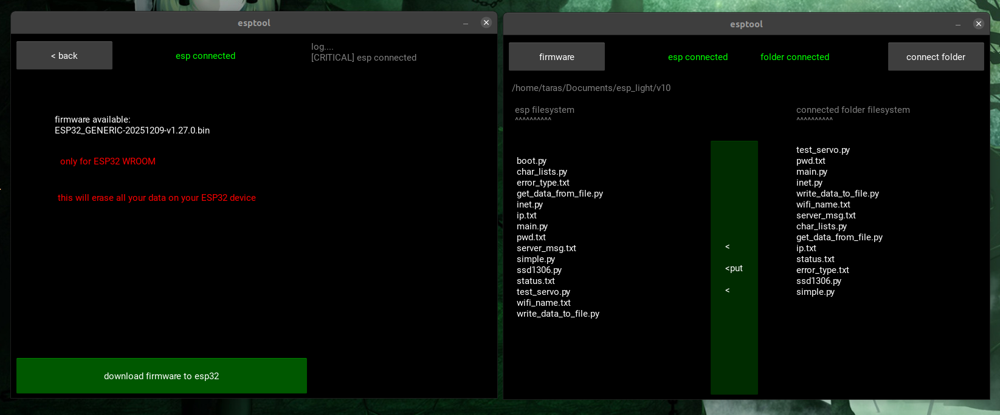

# ESPTOOL (for ESP32 WROOM)
> [українська версія рідмі (ukrainian version of readme)](readme_ua.md)



## 🤨 Why though ?:
for people who are just starting to learn micropython and don't wanna instantly dive into hardware insanity

## 🤓 Description:
GUI utility for reading and writing files from PC to an ESP32 controller. also includes an auto-flashing feature specifically for micropython stuff.

## ☠️ Technologies used:
- everything is written in PYTHON
- GUI built with KIVY
- under the hood it runs on AMPY

## 🌱 Project structure:
- `firmware/` — firmware for ESP32 lives here
- `esp_filesystem.py` - module for reading and writing the filesystem inside ESP32
- `filechooser.py` — module for working with the native GUI folder picker on PC
- `firmware_downloader.py` — ESP32 flashing module
- `main.py` — main startup file

## ⚠️ WARNING:
- this code works ONLY on DEBIAN / UBUNTU machines !
- firmware works ONLY for ESP32 WROOM !
- utility searches for ESP32 ONLY on ttyUSB0 !

## 😎 How to run this thing ?:
1. install required packages
```bash
sudo apt update
sudo apt install python3
sudo apt install python3-pip python3-dev libsdl2-dev libsdl2-image-dev libsdl2-mixer-dev libsdl2-ttf-dev libportmidi-dev libswscale-dev libavformat-dev libavcodec-dev zlib1g-dev libgstreamer1.0-0 gstreamer1.0-plugins-base gstreamer1.0-plugins-good
pip install "kivy[base]"
pip install adafruit-ampy
```
2. launch the utility
```bash
python3 main.py
```

## ✨ And this is how ESPTOOL actually looks in real life


## ❓ Quick questions and answers
1. "what firmware does this thing use ?" - "official 2025 firmware from the official micropython website. firmware is NOT modified"
2. "is this safe ?" - "yeah, this utility is basically just a graphical wrapper around standard ESP32 tools. utility does NOT do any caching or user data storage"
3. "why can't i run code on ESP32 while ESPTOOL is open ?" - "because the ESP32 board is busy with constant file polling. you need to close the utility so it stops interfering with code execution"
4. "why does launching this utility look like starting a nuclear reactor ?" - "because it's KIVY. yeah, it's ridiculously heavy on PC resources, but hey at least the interface looks nice _)"
