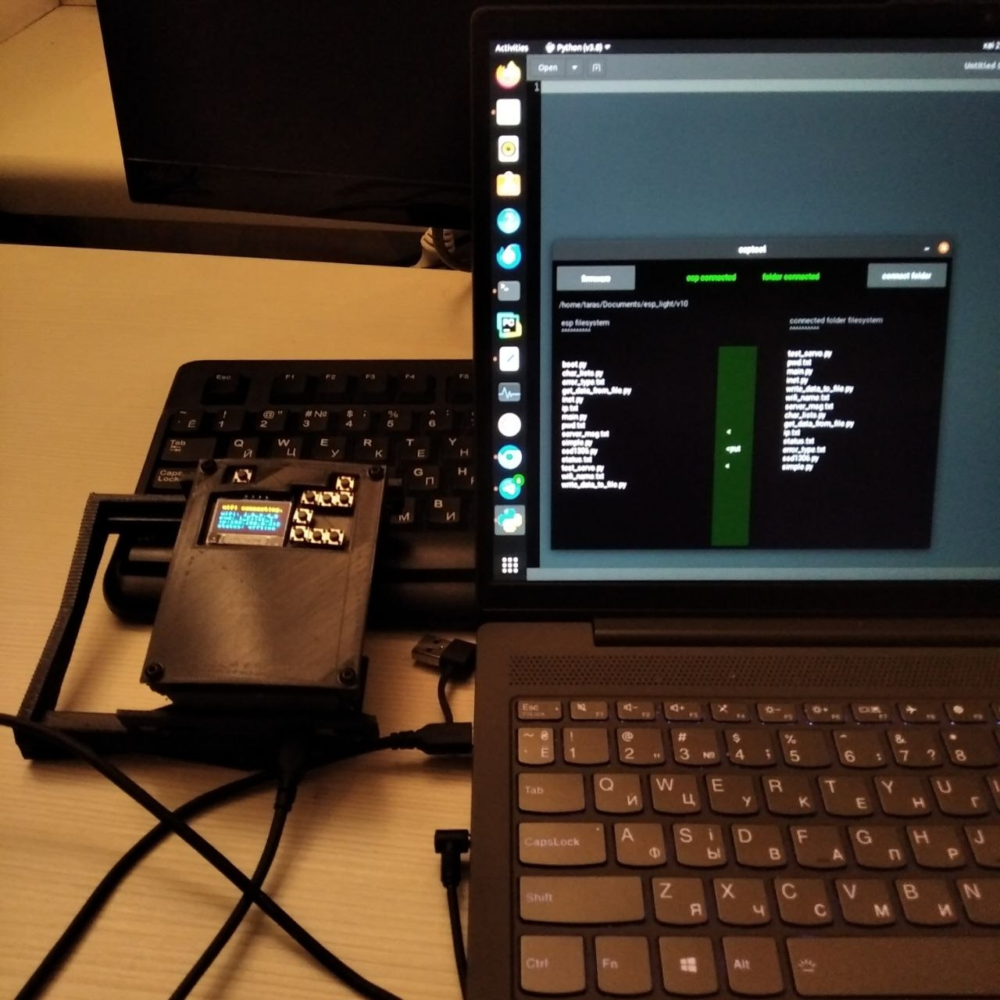

# ESPTOOL (for ESP32 WROOM)


## 🤨 Навіщо ?:
для тих хто починає вчити micropython і не хоче одразу заглиблюватись в нюанси заліза

## 🤓 Опис:
GUI утиліта для читання і запису файлів із пк на контролер ESP32. також тут доступна функція автопрошивки плати для роботи саме із micropython.

## ☠️ Використані технології:
- все написано на PYTHON
- GUI на KIVY
- під капотом працює на AMPY

## 🌱 Структура проекта:
- `firmware/` — тут лежить прошивка для ESP32
- `esp_filesystem.py` - модуль для читання і запису файлової системи всередиині ESP32
- `filechooser.py` — модуль для роботи нативного GUI меню з вибором папки на пк
- `firmware_downloader.py` — модуль для прошивки ESP32
- `main.py` — головний файл для запуска

## ⚠️ ПОПЕРЕДЖЕННЯ:
- цей код працює ЛИШЕ на DEBIAN / UBUNTU машинах !
- прошивка працює ЛИШЕ для ESP32 WROOM !
- утиліта шукає ESP32 ЛИШЕ на ttyUSB0 !

## 😎 Як це запустити ?:
1. встановлюємо необхідні пакети
```bash
sudo apt update
sudo apt install python3
sudo apt install python3-pip python3-dev libsdl2-dev libsdl2-image-dev libsdl2-mixer-dev libsdl2-ttf-dev libportmidi-dev libswscale-dev libavformat-dev libavcodec-dev zlib1g-dev libgstreamer1.0-0 gstreamer1.0-plugins-base gstreamer1.0-plugins-good
pip install "kivy[base]"
pip install adafruit-ampy
```
2. запускаємо утиліту
```bash
python3 main.py
```

## ✨ А ось так ESPTOOL виглядає в реальному житті


## ❓ Швидкі питання і відповіді
1. "яка там прошивка використовується ?" - "офіційна прошивка 2025 року із офіційного сайта micropython. прошивка НЕ модифікована"
2. "чи це безпечно ?" - "так, ця утиліта це протсто графіцна надбудова над стандартнимми інструментами для роботи із ESP32. утиліта не має жодного кешування чи збереження даних користувача"
3. "чому колии відкритий ESPTOOL то я не можу запускати на виконання код на ESP32 ?" - "бо платта ESP32 занята постійним опитуванням файлів, потрібно вимкнути утиліту для того щоб вона не заважала виконанню кода через опитування"
4. "чого запск утиліти виглядає як запуск ядерного реактора ?" - "бо це KIVY. да, він дуже важкий по ресурсах для компютера, але головне що інтерфейс гарний _)"


